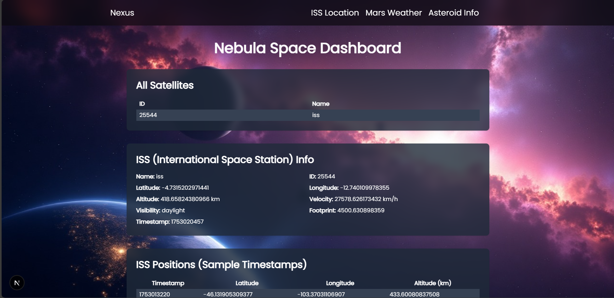

# Nebula
---
Made for the Nebula Nexus Hackathon, 2025.

Source Code: https://github.com/Eashan-EM/Nebula

Example Demonstration Video: https://drive.google.com/file/d/1YAz83hZMLaSQv4wR22_WNueEUy0NLQvD

If the above link does not work, see from the repository itself: [Click Here](./public/example.mp4)

## Problem Statement
Design a web-based dashboard that visualizes live or simulated space mission data, such as satellite telemetry, ISS location, Mars weather, or asteroid tracking.

## Introduction:
### Authors:
1. [Aaryan Khedekar](https://github.com/AaryanKhClasses)
2. [Eashan Morajkar](https://github.com/Eashan-EM)
3. [Krish Acharya](https://github.com/krish-acharya14)

### Overview:
Nebula is a web-based dashboard that visualizes live or simulated space mission data. It provides real-time information on the International Space Station (ISS) location, Mars weather, and asteroid tracking. The dashboard is designed to be user-friendly and visually appealing, making it easy for users to access and understand space-related data.

### Technologies Used:
- **Frontend**: React, Next.js, Tailwind CSS
- **Backend**: Node.js
- **APIs**: Open Notify API (for ISS location), Mars Weather API, Asteroid API (provided by NASA)

### Features:
- **ISS Location**: Displays the current location of the ISS on a map, updating in real-time.
- **Mars Weather**: Provides current weather data on Mars, including temperature, wind speed, and atmospheric pressure.
- **Asteroid Tracking**: Displays information about near-Earth asteroids, including their size, speed, and distance from Earth.

An Example Screenshot of the dashboard is shown below:
